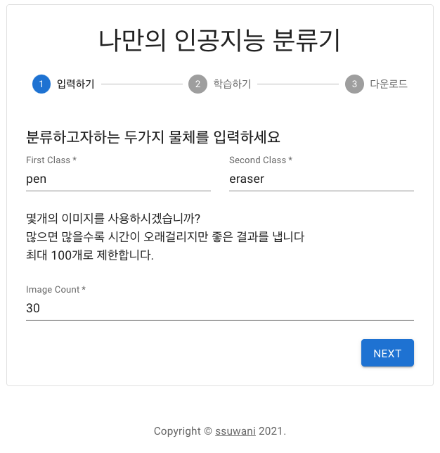
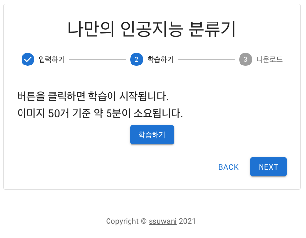
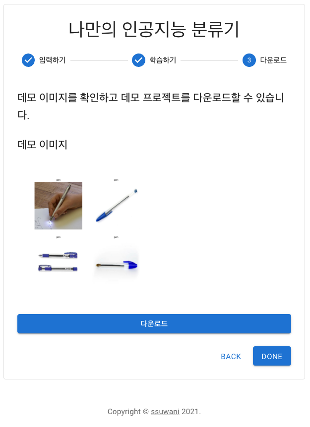
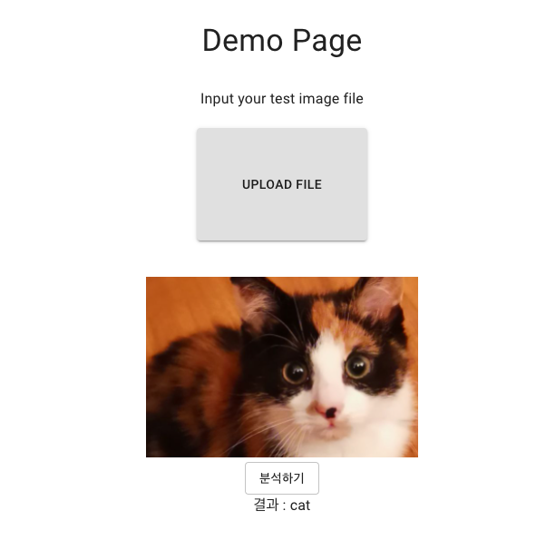

# 인공지능 분류기 만들기

프론트엔드 개발자가 손쉽게 인공지능 분류 서비스를 수행할 수 있도록 도와주는 서비스입니다.

아래의 1, 2번을 따라 진행한 뒤 다운받을 수 있는 파일은 인공지능 분류 서비스를 위한 React로 작성된 데모 페이지입니다.


- 학습을 위한 이미지는 구글에서 다운받았습니다. [google_images_download](https://github.com/hardikvasa/google-images-download)
- 적은수의 이미지로 최대의 성능을 내기위해 전이학습을 사용하였습니다. 이때, 모델은 [MobileNetV2](https://www.tensorflow.org/api_docs/python/tf/keras/applications/mobilenet_v2/MobileNetV2)를 사용하였습니다. 
- RandomFlip, RandomRotation 를 사용해 Data Argumentation을 수행했습니다.


### 1. 분류하고자 하는 두가지 물체 입력, 다운받을 이미지 갯수 입력




### 2. 학습하기



### 3. 데모 이미지 확인 및 다운로드



### 4. 데모 프로젝트 실행

```bash
# unzip react_classifier.zip
# cd react_classifier

npm install # install dependencies for React App

cd api
virtualenv venv # make a virtualenv for AI Service
source venv/bin/activate # dive into virtualenv
pip install -r requirements.txt # install packages

# Execute
cd ..
npm auto-start # It can run both React App and Ai Service
```


### 5. 데모 프로젝트 Preview

